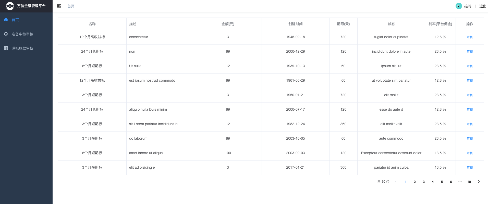

# 金融管理后台


## 项目信息

- git：http://git.itcast.cn/development/project-p2p-cmm-java-react
- mock：https://mock.boxuegu.com/project/335/interface/api/7056

## 技术栈

-   使用 vue-element-admin 集成方案

-  vue [2.6.10] + element-ui[2.7.0] + axios 

## 图示
 
## 项目运行

```bash
# clone the project
git clone http://git.itcast.cn/development/project-p2p-cmm-java-react.git

# install dependency
npm install

# develop
npm run dev

# build for test environment
npm run build:stage

# build for production environment
npm run build:prod
```

This will automatically open http://localhost:9528

## 项目结构
├── build                      # 构建相关 <br/>
├── mock                       # 项目mock 模拟数据<br/>
├── plop-templates             # 基本模板<br/>
├── public                     # 静态资源<br/>
│   │── favicon.ico            # favicon图标<br/>
│   └── index.html             # html模板<br/>
├── src                        # 源代码<br/>
│   ├── api                    # 所有请求<br/>
│   ├── assets                 # 主题 字体等静态资源<br/>
│   ├── components             # 全局公用组件<br/>
│   ├── directive              # 全局指令<br/>
│   ├── filters                # 全局 filter<br/>
│   ├── icons                  # 项目所有 svg icons<br/>
│   ├── lang                   # 国际化 language<br/>
│   ├── layout                 # 全局 layout<br/>
│   ├── router                 # 路由<br/>
│   ├── store                  # 全局 store管理<br/>
│   ├── styles                 # 全局样式<br/>
│   ├── utils                  # 全局公用方法<br/>
│   ├── vendor                 # 公用vendor<br/>
│   ├── views                  # views 所有页面<br/>
│   ├── App.vue                # 入口页面<br/>
│   ├── main.js                # 入口文件 加载组件 初始化等<br/>
│   └── permission.js          # 权限管理<br/>
├── tests                      # 测试<br/>
├── .env.xxx                   # 环境变量配置<br/>
├── .eslintrc.js               # eslint 配置项<br/>
├── .babelrc                   # babel-loader 配置<br/>
├── .travis.yml                # 自动化CI配置<br/>
├── vue.config.js              # vue-cli 配置<br/>
├── postcss.config.js          # postcss 配置<br/>
└── package.json               # package.json<br/>

## 项目文档

- 文档： https://panjiachen.gitee.io/vue-element-admin-site/zh/guide/
- 组件：https://element.eleme.cn/#/zh-CN/component/installation
- 实例项目参考： https://github.com/PanJiaChen/vue-element-admin


