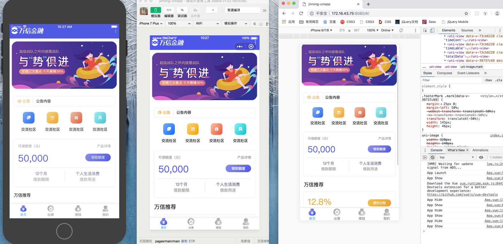

## uni-app项目 万信金融

>万信金融项目已H5为主  结合uni-app 的全端特性 同步实现了安卓、iOS、微信小程序的同步实现

## 项目结构

┌─components            uni-app公共组件目录  
│  └─comp-a.vue         可复用的a组件 
├─pages                 业务页面文件存放的目录 详细内页查看pages.json  
├─static                存放本应用的图片静态资源 
├─utils                 公共资源存放 
│  └─common.css         公用样式文件 
│  └─request.js         统一请求打包文件 
│  └─utils.js           公用函数打包文件 
├─main.js               Vue初始化入口文件 
├─App.vue               应用配置，用来配置App全局样式以及监听 应用生命周期 
├─manifest.json         配置应用名称、appid、logo、版本等打包信息，详见 
└─pages.json            配置页面路由、导航条、选项卡等页面类信息，详见 

##  MOCK

- https://mock.boxuegu.com/project/335/interface/api/7056

## Git

- http://git.itcast.cn/development/project-p2p-java-uniapp

## 原型
- http://czpm.itcast.cn/%E4%B8%87%E4%BF%A1%E9%87%91%E8%9E%8D/#g=1&p=%E6%9B%B4%E6%96%B0%E6%97%A5%E5%BF%97

## 安装使用

- 一、下载HbuilderX 导入运行
 
- 二、 通过安装脚手架 安装依赖环境
	- npm install -g @vue/cli
	- vue create -p dcloudio/uni-preset-vue my-project
	> 全局安装vue-cli，并创建uni-app   用现有项目内容替换掉新建项目的src文件内容即可
	- 执行命令  npm run dev:h5  
